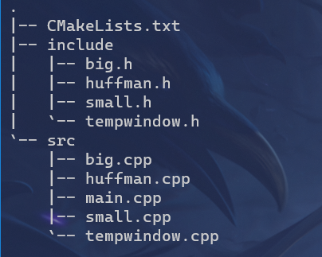
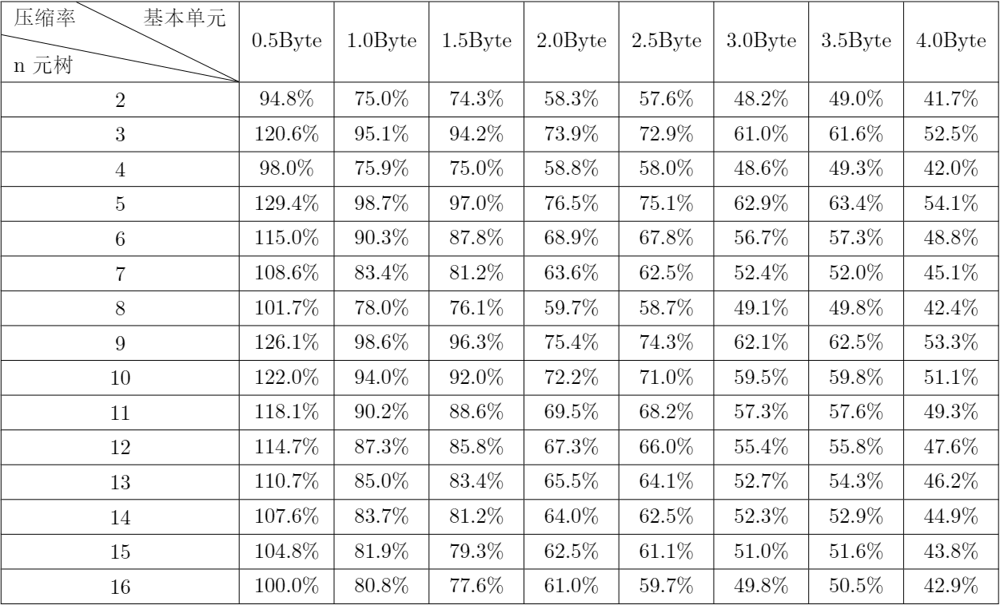
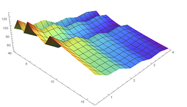

# Huffman 编码压缩/解压器

#### 一、问题描述

在合适的情况下，利⽤ Huffman 编码对⽂件进⾏压缩可以减少其占⽤空间，同时在需要使⽤到⽂件的 时候也可以根据压缩⽂件中所提供的信息来将其还原为原⽂件。本次实验中，我们将实现⼀个基于 Huffman 编码的⽂件压缩/解压缩⼯具。

#### 二、基本要求

基于 Huffman 编码实现⼀个压缩器和解压缩器（其中 Huffman 编码以字节作为统计和编码的基本符号 单元），使其可以对任意的⽂件进⾏压缩和解压缩操作。针对编译⽣成的程序，要求压缩和解压缩部分 可以分别独⽴运⾏。具体要求为：

- 每次运⾏程序时，⽤⼾可以指定**只压缩/只解压**缩指定路径的⽂件。实现的时候不限制与⽤⼾的交 互⽅式，可供参考的⽅式包括但不限于
  - 根据命令⾏参数指定功能（压缩/解压缩）和输⼊/输出⽂件路径
  - GUI 界⾯
  - 运⾏程序后由⽤⼾交互输⼊指定功能和路径
- **【CAUTION!】不被允许的交互⽅式**： 通过修改源代码指定功能和⽂件路径

- 压缩时不需要指定解压⽂件的⽬标路径，解压缩时不需要指定压缩前原⽂件的路径，压缩后的⽂件 可以换到另⼀个位置再做解压缩

#### 三、程序能实现的功能

1. 压缩指定路径的任意格式的文件
2. 解压指定路径的文件(无损)
3. 可以选择压缩的基本单元(0.5Byte ~ 4Byte)
4. 可以选择使用多元 Huffman 数进行压缩 (2~16)
5. 3，4 项同时使用

#### 四、实验思路

1. 压缩
   - 第一遍扫描文件，根据用户选择的压缩基本单元，统计每一种基本单元出现的频次
   - 以出现的频次作为权重，根据用户选择构建 Huffman 树，若用户选择多元压缩，则首先补全节点数，其次使用优先队列，每次弹出最小的元素，构造 Huffman 树
   - 根据构造出的 Huffman 树，求得 Huffman 编码 (压缩单元较小时，使用指针 new 内存的形式加速，压缩单元较大时，使用 map 来控制内存的使用)
   - 首先输出被压缩文件的类型，压缩时使用的基本单元大小，Huffman 树种类，再输出每一个基本单元出现的频次
   - 再次扫描文件，每当获取一个基本单元大小的字节，二进制输出它的 Huffman 编码 (每八位以一个字符的形式输出)
2. 解压
   - 首先获得压缩文件头部的相关信息，以及各个基本单元出现的频次
   - 用和压缩时完全相同的方式构造出 Huffman 树，获得 Huffman 编码
   - 扫描剩下的文件内容，根据二进制编码，转化为原来的基本单元输出

#### 五、项目结构



#### 六、不同文件的具体内容

1. **main.cpp**

   - 功能界面，实现与用户的交互

2. **huffman.h**和**huffman.cpp**

   实现构造 Huffman 树和 Huffman 编码

   - 存储 Huffman 树的节点

     ```c++
     typedef struct HTNode
     {
         long long int num;       //表示第几个元素
         long long int key;       //对应元素的值
         int weight;              //权值
         long long int parent;    //双亲
         long long int child[16]; //孩子
         friend bool operator<(HTNode a, HTNode b)
         {
             return a.weight > b.weight;
         }
     } HTNode, *HuffmanTree;
     ```

   - 各函数的定义

     ```c++
     void init(HuffmanTree &HT, std::map<long long int, int> &map, char **&HC, int tree_n);
     void init_big(HuffmanTree &HT, std::map<long long int, int> &map, std::unordered_map<long long int, char *> &HC, int tree_n);
     void init_for_de(HuffmanTree &HT, std::map<long long int, int> &map, int tree_n);
     void output_huffmantree(HuffmanTree &HT, std::map<long long int, int> &map, int tree_n);
     int judge(int a);
     ```

     - **void init(HuffmanTree &HT, std::map<long long int, int> &map, char \*\*&HC, int tree_n)**

       实现压缩基本单元较小时 Huffman 树的生成

       ```c++
       void init(HuffmanTree &HT, std::map<long long int, int> &map, char **&HC, int tree_n)
       {
           std::cout << "正在构造Huffman树：" << std::endl;
           //初始化 huffman树
           long long int fre = map.size();
           HT = new HTNode[2 * fre];
           for (long long int i = 0; i < 2 * fre; i++)
           {
               HT[i].num = i;
               HT[i].key = 0;
               HT[i].weight = 0;
               for (int j = 0; j < tree_n; j++)
                   HT[i].child[j] = 0;
               HT[i].parent = 0;
           }
           int index = 1;
           HT[0].weight = INT_MAX;
           for (auto iter : map)
           {
               HT[index].key = iter.first;
               HT[index].weight = iter.second;
               index++;
           }

           //使用优先队列构造huffman树
           std::priority_queue<HTNode> ans;
           for (int i = 1; i <= fre; i++)
               ans.push(HT[i]);
           if (tree_n != 2)
           {
               int blank;
               if (fre % (tree_n - 1) == 0)
                   blank = 1;
               else
                   blank = tree_n - fre % (tree_n - 1);
               if (blank != tree_n - 1)
               {
                   HuffmanTree Tree_blank = new HTNode;
                   Tree_blank->key = 0;
                   Tree_blank->parent = 0;
                   Tree_blank->weight = 0;
                   for (int j = 0; j < tree_n; j++)
                       Tree_blank->child[j] = 0;
                   for (int i = 0; i < blank; i++)
                   {
                       Tree_blank->num = fre + i + 1;
                       ans.push(*Tree_blank);
                   }
               }
           }
           //要从加了0之后开始计算 即修正fre
           for (long long int now = fre + 1; now < 2 * fre; now++)
           {
               int now_weight = 0;
               for (int i = 0; i < tree_n; i++)
               {
                   HTNode temp_Node = ans.top();
                   HT[temp_Node.num].parent = now;
                   HT[now].child[i] = temp_Node.num;
                   now_weight += temp_Node.weight;
                   ans.pop();
               }
               HT[now].weight = now_weight;
               if (ans.empty())
                   break;
               ans.push(HT[now]);
           }
           //构造 huffman编码
           char *cd = new char[fre];
           cd[fre - 1] = '\0';
           for (long long int i = 1; i <= fre; i++)
           {
               long long int start = fre - 1;
               long long int j, p;
               for (j = i, p = HT[i].parent; p != 0; j = p, p = HT[p].parent)
               {
                   int index = 0;
                   while (HT[p].child[index] != j)
                       index++;
                   int wei = judge(tree_n);
                   for (int i = 0; i <= wei - 1; i++)
                       cd[--start] = ((index >> i) & 1) + '0';
               }
               HC[HT[i].key] = (char *)malloc((fre - start) * sizeof(char));
               strcpy(HC[HT[i].key], &cd[start]);
           }
       }
       ```

     - **void init_big(HuffmanTree &HT, std::map<long long int, int> &map, std::unordered_map<long long int, char \*> &HC, int tree_n)**

       实现压缩基本单元较小时 Huffman 树的生成，代码实现与较小时基本相同

     - **void init_for_de(HuffmanTree &HT, std::map<long long int, int> &map, int tree_n)**

       解压时用于构造 Huffman 树，由于只需要构造 Huffman 树，而不需要 Huffman 编码 (可以根据树一步步查找)，所以删去求 Huffman 编码的过程，其余内容一致

     - **void output_huffmantree(HuffmanTree &HT, std::map<long long int, int> &map, int tree_n)**

       展示 Huffman 树

       ```c++

       void output_huffmantree(HuffmanTree &HT, std::map<long long int, int> &map, int tree_n)
       {
           if (map.size() == 1)
               std::cout << "只有一个元素!" << std::endl;
           else
           {
               std::cout << "Huffman树:" << std::endl;
               printf("       |  key   | weight | parent |  ch\n");
               long long int fre = map.size();
               for (long long int i = 1; i < 2 * fre; i++)
               {
                   printf("%6lld | %6lld | %6d | %6lld ", i, HT[i].key, HT[i].weight, HT[i].parent);
                   for (int j = 0; j < tree_n; j++)
                       printf("| %6lld ", HT[i].child[j]);
                   putchar('\n');
                   if (HT[i].parent == 0)
                       break;
               }
           }
           getchar();
       }
       ```

     - **int judge(int a)**

       根据 Huffman 树节点孩子的个数，判断需要使用多少位的编码

       ```c++
       int judge(int a) //判断编码
       {
           if (a <= 2)
               return 1;
           else if (a > 2 && a <= 4)
               return 2;
           else if (a > 4 && a <= 8)
               return 3;
           else
               return 4;
       }
       ```

3. **small.h**和**small.cpp**

   实现压缩过程

   - 类的定义

     ```c++
     class small
     {
     public:
         small();
         ~small();
         void compress();
         bool compress_input();
         void compress_output();
         void compress_output_big();
     
     private:
         int select;                                    //压缩单位选择
         int tree_n;                                    //n元Huffman树
         float size;                                    //文件大小
         int char_size;                                 //防止读取出现错误
         int now_byte;                                  //当前读取到的的文件位数
         std::string data_path;                         //需要压缩的文件的路径
         std::string ans_path;                          //需要存储的完成压缩的路径
         std::string type;                              //用来存储被压缩的文件的格式
         std::map<long long int, int> map;              //需要压缩的文件中不同字符的数量
         std::unordered_map<long long int, char *> HC_; //不同字符对应的 huffman编码
         char **HC;                                     //小数据量用数组
         HuffmanTree HT;                                //huffman树
     };
     ```

     - **void compress()**

       与用户交互，压缩相关选项的选择

     - **bool small::compress_input()**

       统计基本单元出现的次数，具体计数部分如下所示 (需要注意的是最后可能有尚未满足一个基本单元的内容，未满足的部分用 0 替代 / 需要特判只有一个基本单元的情况)

       ```c++
       char c;
       int every = 8 * select * 0.5; //单位 bit
       long long int tt_key = 0;     //用来记录 key
       int now_bit = 0;              //用来记录当前读入了多少个bit
       int char_now = 0;             //用来记录当前读取的字符使用到的 bit
       std::unordered_map<long long int, int> temp_map;
       while (infile.get(c))
       {
           char_size++;
           char_now = 0;
           while (char_now < 8)
           {
               while (char_now < 8)
               {
                   tt_key += (long long int)(((int)c >> (7 - char_now)) & 1) << (every - 1 - now_bit);
                   char_now++;
                   now_bit++;
                   if (now_bit == every)
                       break;
               }
               if (now_bit == every)
               {
                   if (temp_map.count(tt_key) == 0)
                   {
                       map[tt_key] = 1;
                       temp_map[tt_key] = 1;
                   }
                   else
                       map[tt_key]++;
                   now_bit = 0;
                   tt_key = 0;
               }
           }
       }
       if (now_bit != 0)
       {
           if (temp_map.count(tt_key) == 0)
               map[tt_key] = 1;
           else
               map[tt_key]++;
       }
       ```

     - **void small::compress_output()**

       先输出相关基本信息，接着根据 Huffman 编码，对文件进行压缩，具体压缩部分如下

       ```c++
       char c;
       int every = 8 * select * 0.5; //单位 bit
       int tt_key = 0;               //用来记录 key
       int now_bit = 0;              //用来记录当前读入了多少个bit
       int char_now = 0;             //用来记录当前读取的字符使用到的 bit
       while (infile.get(c))
       {
           now_byte++;
           char_now = 0;
           while (char_now < 8)
           {
               while (char_now < 8)
               {
                   tt_key += (((int)c >> (7 - char_now)) & 1) << (every - 1 - now_bit);
                   char_now++;
                   now_bit++;
                   if (now_bit == every)
                       break;
               }
               if (now_bit == every)
               {
                   i = 0;
                   while (HC[tt_key][i] != '\0')
                   {
                       tt += (HC[tt_key][i] - '0') << (7 - num);
                       i++;
                       num++;
                       if (num == 8)
                       {
                           outfile.put((char)tt);
                           num = 0;
                           tt = 0;
                       }
                   }
                   tmp_struct = {now_byte, size}; //实时更新当前的进度
                   now_bit = 0;
                   tt_key = 0;
               }
           }
       }
       //输出最后一个可能没有到达一个单位的字符
       if (now_bit != every && now_bit != 0)
       {
           i = 0;
           while (HC[tt_key][i] != '\0')
           {
               tt += (HC[tt_key][i] - '0') << (7 - num);
               i++;
               num++;
               if (num == 8)
               {
                   outfile.put((char)tt);
                   num = 0;
                   tt = 0;
               }
           }
       }
       //输出可能没有到达8bit的最后一个字符
       if (num != 0)
           outfile.put((char)tt);
       tmp_struct = {now_byte, size};
       ```
       
     - **void small::compress_output_big()**
     
         所选基本单元较大时使用函数，具体实现基本相同
   
4. **big.h**和**big.cpp**

    实现解压过程

    - 类的定义

        ```c++
        class big
        {
        public:
            big();
            void decompress();
            bool decompress_input_output();
        
        private:
            int select;                       //压缩单位选择
            int tree_n;                       //n元Huffman树
            float size;                       //文件大小
            int now_byte;                     //已经读取的字符数
            std::string data_path;            //需要解压的文件的路径
            std::string ans_path;             //解压完成的文件路径
            std::string type;                 //用来存储被压缩的文件的格式
            std::map<long long int, int> map; //需要解压的文件中不同字符的数量
            HuffmanTree HT;                   //huffman树
        };
        ```

        - **void decompress()**

            与用户进行交互

        - **bool decompress_input_output()**

            解压时，输入与输出在一个函数实现 (特判只有一个基本单元的情况) 解压关键部分如下所示

            ```c++
            char ans[8];
            char c;
            int index = 0;
            int fre = map.size();
            int root_loc;
            int now;
            int now_bit = 0; //记录当前输出字符到的bit
            int out_tmp = 0; //用来记录输出的字符
            int wei = judge(tree_n);
            int wei_now = 0;
            int switch_child = 0;
            for (root_loc = 1; root_loc < 2 * fre; root_loc++)
            {
                if (HT[root_loc].parent == 0)
                    break;
            }
            now = root_loc;
            while (1)
            {
                infile.get(c);
                int tt = c;
                index = 0;
                for (int i = 7; i >= 0; i--)
                    ans[index++] = ((tt >> i) & 1) + '0';
                index = 0;
                while (1)
                {
                    switch_child += (ans[index] - '0') << (wei - 1 - wei_now);
                    wei_now++;
                    if (wei == wei_now)
                    {
                        wei_now = 0;
                        now = HT[now].child[switch_child];
                        switch_child = 0;
                    }
                    index
                    if (HT[now].child[0] == 0)
                    {
                        //获取对应权值对应的 bit位
                        int int_to_char = HT[now].key;
                        char ans_[every + 1];
                        ans_[every] = '\0';
                        for (int j = 0; j < every; j++)
                            ans_[j] = ((int_to_char >> (every - 1 - j)) & 1) + '
                        int j = 0;
                        while (ans_[j] != '\0')
                        {
                            now_bit++;
                            out_tmp += (ans_[j] - '0') << (8 - now_bit);
                            if (now_bit == 8)
                            {
                                char_size--;
                                outfile.put(out_tmp);
                                now_byte++;
                                tmp_struct = {now_byte, size};
                                out_tmp = 0;
                                now_bit = 0;
                            }
                            j++;
                            if (char_size == 0)
                                break;
                        }
                        now = root_loc;
                    }
                    if (index == 8 || char_size == 0)
                        break;
                }
                if (char_size == 0)
                    break;
            }
            ```

5. **tempwindow.h**和**tempwindow.cpp**

    多线程，命令行绘制进度界面

    - 用于传值的结构体

        ```c++
        struct poss_help
        {
            int now_b;
            float total;
        };
        ```

    - 具体绘制函数

        ```c++
        void *possesion(void *threadarg)
        {
            while (1)
            {
                struct poss_help *p = (struct poss_help *)threadarg;
                int now_byte = p->now_b;
                float size = p->total;
                int temp = 40 * (now_byte / size);
                int temp_n = 40 - temp;
                putchar('\r');
                putchar('[');
                for (int i = 0; i < temp; i++)
                    putchar('#');
                for (int i = 0; i < temp_n; i++)
                    putchar(' ');
                std::cout << "] " << (int)(100 * (now_byte / size)) << "%  ";
                if ((100 * (now_byte / size)) > 99)
                {
                    putchar('\r');
                    putchar('[');
                    for (int i = 0; i < 40; i++)
                        putchar('#');
                    std::cout << "] 100%";
                    break;
                }
                //因为字节可能计算失误 可能会导致进度条最后跳一下
            }
            pthread_exit(NULL);
        }
        ```

    - 多线程的调用

        - 建立

            ```c++
            pthread_t threads;
            poss_help tmp_struct;
            tmp_struct = {now_byte, size};
            pthread_create(&threads, NULL, possesion, (void *)&tmp_struct);
            ```

        - 结束

            ```c++
            pthread_join(threads, NULL);
            ```

#### 七、编译过程

- 编译环境
    - Ubuntu-20.04 ( wsl2 )
    - gcc 9.3.0
    - cmake version 3.16.3

- CMakeLists.txt (注意修改Debug模式和Release模式)

    ```cmake
    cmake_minimum_required(VERSION 3.5)
    
    project(yasuo)
    
    set (CMAKE_CXX_STANDARD 17)
    
    set(CMAKE_CXX_FLAGS "${CMAKE_CXX_FLAGS} -pthread" )
    
    set(SOURCES
        src/main.cpp
        src/big.cpp
        src/small.cpp
        src/tempwindow.cpp
        src/huffman.cpp)
    
    add_definitions(-w)# system忽略了返回值，消除编译警告
    
    add_executable(yasuo ${SOURCES})
    
    add_definitions(-w)
    
    SET(CMAKE_BUILD_TYPE "Release")
    
    target_include_directories(yasuo
    PRIVATE
        ${CMAKE_CURRENT_SOURCE_DIR}/include)
    ```
    
- 编译操作(Release版本为例，首先进入项目目录)

    ```bash
    mkdir Release
    cd Realease
    cmake ..
    make
    ./yasuo
    ```


#### 八、运行效果

- 使用1.5Byte为基本单元，三叉Huffman树压缩png文件，源文件258kb，压缩后182kb，解压后258kb，效果较为明显，同时文件解压后无任何变化

    

- 性能测试

    使用该程序压缩大小1.3G的txt文档

    - 压缩用时：130.917s
    
    
    - 解压用时：113.172s
    
    - 压缩效率：$46\%$
    
        

#### 九、关于Huffman压缩的探索

- 压缩一包含中英文及数字的txt文档，压缩效果如下(压缩率=$$\frac{压缩文件大小}{原始文件}$$)
    

- 利用上述数据作图  (mathematica作图有一定偏差)

    


- 根据上述实验数据可以看出:
    - 压缩基本单元为0.5Byte时，基本没有压缩效果
    - 随着压缩基本单元的增大，压缩效果总体上呈现上升趋势
    - 在压缩的基本单元从3.0Byte变为3.5Byte时，压缩效果均有小幅下降
    - 当选用$2^n$叉Huffman树时，压缩效果明显更佳，而当选用$2^n+1$叉Huffman树时，压缩效果较差 ($2^n$叉Huffman树每一个节点都刚好可以利用 $n$ bit的Huffman编码)
    
    **因此，在压缩txt文本文件时，选用$2^n$叉Huffman树，在综合时间的情况下选择更大的压缩基本单元，能够提高压缩效率**
    
    > 同时值得指出的是，对于图片，视频等文件类型，基本单元极有可能发生出现次数相近的情况，此时综合时间等考虑，可以尽量选择1Byte为压缩的基本单元

#### 十、实验收获

- 更加熟悉了Huffman树，及相关算法
- 对Huffman压缩时选用的基本单元及n叉Huffman树有了全新的认识
- 提升了文件操作，位运算的能力


